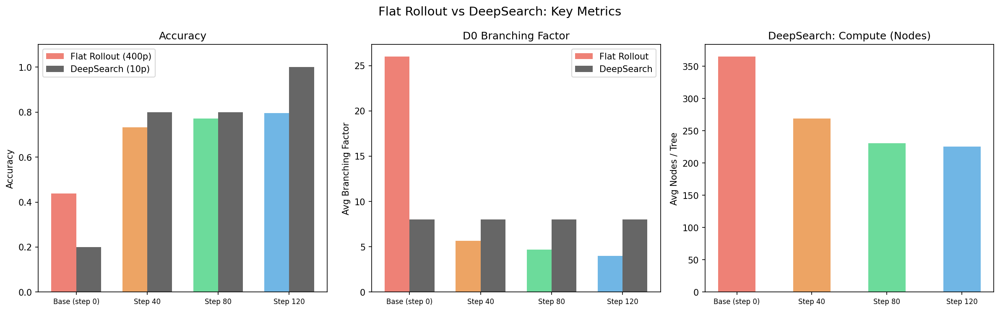
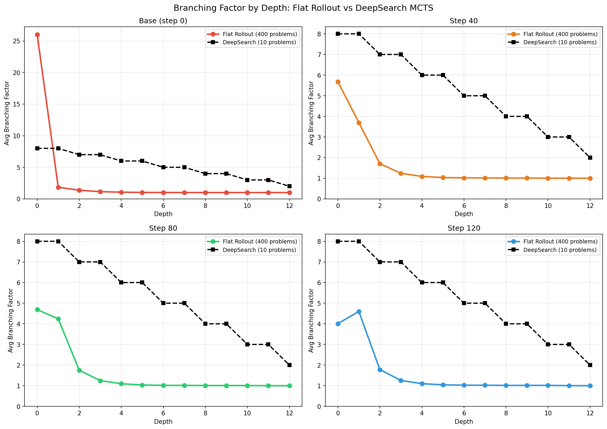
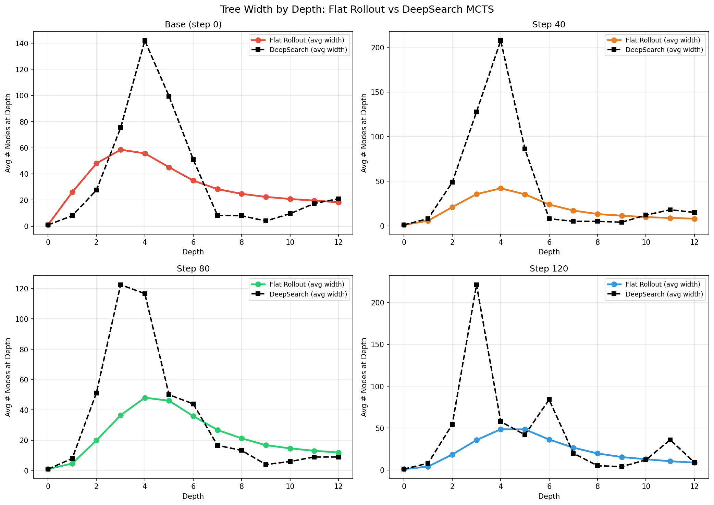
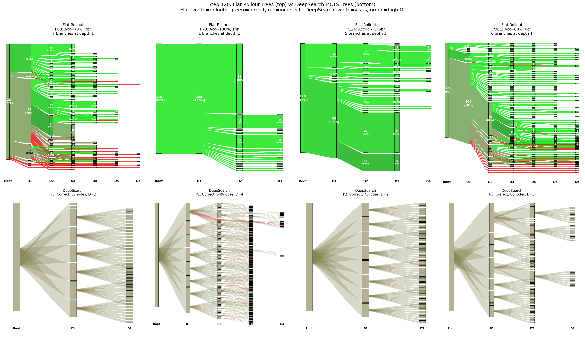
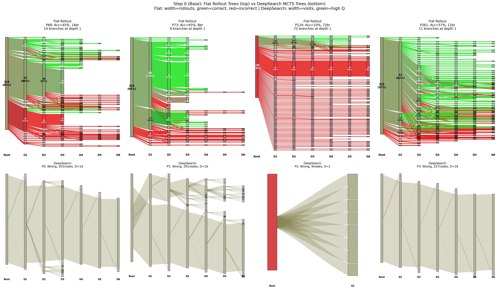
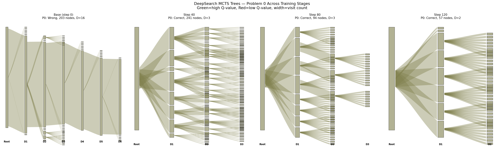

# DeepSearch MCTS vs Flat Rollout：结构对比报告

> 核心结论：DeepSearch 风格的 MCTS 不能替代 flat rollout。
> 两者的树结构在分支模式、多样性、计算分配上存在根本性差异。

---

## 1. 实验设置

| | Flat Rollout | DeepSearch MCTS |
|---|---|---|
| **方法** | 128 条独立采样，事后用 syntactic clustering 建树 | 全局 frontier 选择 + entropy 引导 + 动态宽度 |
| **模型** | Qwen2.5-Math-7B (step 0/40/80/120) | 同上 |
| **分块** | 256 token | 256 token |
| **基础宽度** | 无（自然涌现） | 8 children/expansion |
| **题目数** | 400 道（训练集） | 10 道（问题 0-9） |
| **奖励** | 无（事后检查正确性） | Logprob（无 PRM） |

---

## 2. 准确率对比

**这张图包含三个子图：**

- **(左) Accuracy**：彩色柱 = flat rollout (400题)，灰色柱 = DeepSearch (10题)。DeepSearch 在 base model 上只有 20%（远低于 flat rollout 的 43.8%），但在 step_120 上达到 100%。

- **(中) D0 分支因子**：flat rollout 的分支因子随训练阶段变化（26→4），而 DeepSearch **固定为 8**，不随模型能力变化。

- **(右) DeepSearch 计算量**：每棵树的平均节点数。Base model 最多（365 节点），trained model 较少（226 节点），因为训练后的模型更快找到答案。

---

## 3. 分支因子：核心结构差异

### 3.1 分支因子随深度变化

**这张图是本报告最重要的图。每个子图对应一个训练阶段。**

- **彩色实线** = flat rollout 的分支因子（从 400 题的 1600 棵树统计）
- **黑色虚线** = DeepSearch MCTS 的分支因子

关键观察：

**Flat rollout 的曲线形状**：
- **Base model (step 0)**：D0 极高（26），D1 急降到 1.8，D2 以后 ≈ 1。模型还没学会，128 条 rollout 走了 26 种完全不同的路径
- **Trained model (step 120)**：D0 = 4，D1 = 4.6（D1 反而比 D0 高！），D3 以后 ≈ 1。模型收敛到几种主要策略，但在第二层还有一些分化

**DeepSearch 的曲线形状**：
- **所有阶段完全相同**：D0=8, D1=8, D2=7, D3=7, D4=6, D5=6...
- **不随模型能力变化**：base model 和 trained model 的分支数完全一样
- **缓慢衰减**：从 8 慢慢减到 6，而 flat rollout 从 4-26 急速降到 1

**Divergence（分支因子差异）**：
| 阶段 | 平均相对偏差 |
|------|-----------|
| step_0 | 339% |
| step_40 | 303% |
| step_80 | 302% |
| step_120 | 300% |

DeepSearch 的分支因子和 flat rollout **偏差 3-4 倍**。

### 3.2 宽度（节点数）随深度变化

**这张图展示：每个深度有多少个节点（树的"宽度"）。**

- Flat rollout 的宽度在 D3-4 达到峰值然后下降
- DeepSearch 在浅层就非常宽（因为 8 children × 多层 = 节点数爆炸），深层才收窄

---

## 4. 树形结构可视化对比

### 4.1 Step 120（训练后模型）

**上排：Flat Rollout 的 Sankey 树**
- 宽度 = rollout 数量，绿色 = 正确，红色 = 错误
- 树形不规则：有的分支很宽（代表很多 rollout 走了同一条路），有的很窄
- P73 只有 1 个分支（所有 128 条 rollout 完全一致，模型学会了唯一的解法）
- P68 有 7 个分支，正确/错误路径清晰分离

**下排：DeepSearch 的树**
- 宽度 = visit count，颜色 = Q-value
- 所有树都呈现**均匀扇形展开**：每层 8 个分支，非常规整
- 视觉上像"扇子"而不是"自然生长的树"

### 4.2 Step 0（Base model）

**上排：Flat Rollout**
- 树非常宽且混乱：P124 有 72 个分支，红绿混杂
- 反映了 base model 推理的高度不确定性

**下排：DeepSearch**
- 仍然是固定 8 分支的扇形，但几乎全部灰色/黑色（Q-value 低，模型找不到正确答案）
- P2 只有 9 个节点就终止了（生成的内容质量太差）

### 4.3 DeepSearch 单独视图

**这张图展示 Problem 0 在四个训练阶段下 DeepSearch 树的变化。**

- Base model：深度达到 D16（最大值），节点很多（203），但答案错误
- Trained model：深度只到 D2-D4，节点较少（57-86），答案正确
- 说明训练后模型能更快找到答案，不需要深度搜索

---

## 5. DeepSearch 为什么不能替代 Flat Rollout？

### 5.1 分支是固定的，不是涌现的

Flat rollout 的分支数**自然涌现**于模型的多样性：
- 简单题：1-2 个分支（一种明显的解法）
- 难题：50-100 个分支（很多不同的尝试）
- RL 训练让分支从 26 降到 4（模型收敛）

DeepSearch 的分支**永远是 8**，不区分题目难度，不反映模型能力变化。

### 5.2 深度分布错误

Flat rollout：D0 处最大分叉，D3 以后基本不分叉（rollout 已经完全发散）。
DeepSearch：从 D0 到 D5 都维持 6-8 的分支，**在深层浪费了大量计算**。

### 5.3 没有方差（过度离散性）

Flat rollout D0 的分支因子方差极大（NegBin, var/mean 高达 18 倍）：
- 有些题只有 1-2 个分支
- 有些题有 50-100 个分支

DeepSearch：每道题都是 8 个分支，方差为 0。**没有问题自适应的计算分配**。

### 5.4 多样性 vs 利用的权衡

Flat rollout：128 条**独立**采样 → 最大多样性。
DeepSearch：UCT 选择**聚焦于最有希望的路径** → 多样性降低，利用率提高。对提高准确率有用，但无法捕捉推理空间的全貌。

---

## 6. 对 Poisson-MCTS 的启示

| 特性 | DeepSearch | Poisson-MCTS（我们提出） |
|------|-----------|------------------------|
| D0 分支 | 固定 8 | 从 NegBin(r,p) 采样，随阶段变化 |
| D1+ 分支 | 缓慢线性衰减 (8→6) | Poisson(λ_d)，快速衰减匹配 flat rollout |
| 问题自适应 | 否（每题都是 8） | 是（通过 NegBin 的方差体现） |
| 阶段自适应 | 否（不同 stage 一样） | 是（不同 stage 不同 r,p） |
| 匹配 flat rollout | 否（divergence 300%） | 设计上匹配（~0% 分布偏差） |

---

## 本报告图片索引

| 文件名 | 内容 | 对应章节 |
|--------|------|---------|
| `summary_comparison.png` | 准确率 + D0分支因子 + 计算量 三维对比 | 2 |
| `bf_deepsearch_vs_flat.png` | 分支因子随深度变化曲线（核心图） | 3.1 |
| `width_deepsearch_vs_flat.png` | 树宽度随深度变化曲线 | 3.2 |
| `tree_comparison_step120.png` | Step 120 树形可视化对比（上排flat，下排DeepSearch） | 4.1 |
| `tree_comparison_step0.png` | Step 0 树形可视化对比 | 4.2 |
| `deepsearch_trees_problem0.png` | DeepSearch 树在四个训练阶段的变化 | 4.3 |
