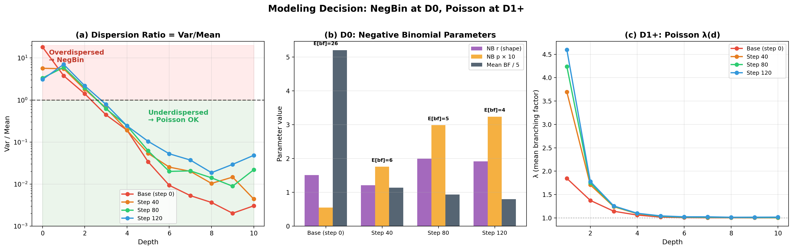
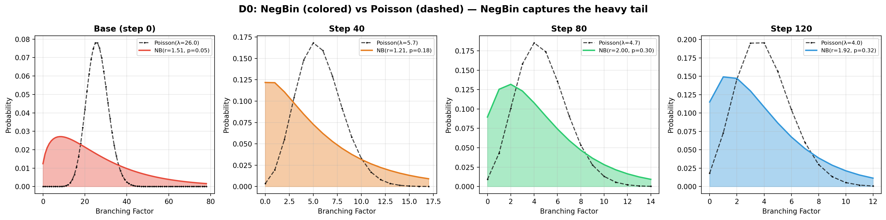
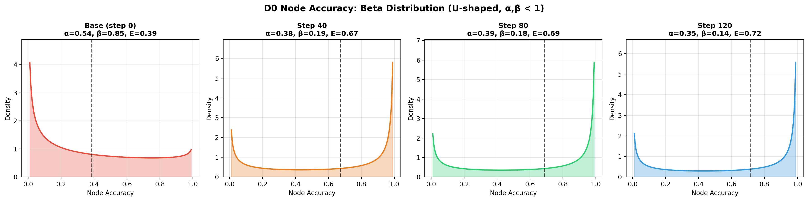
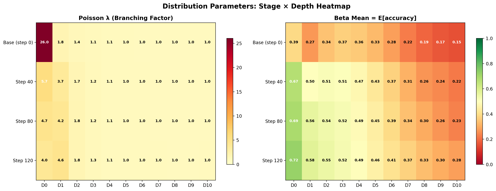
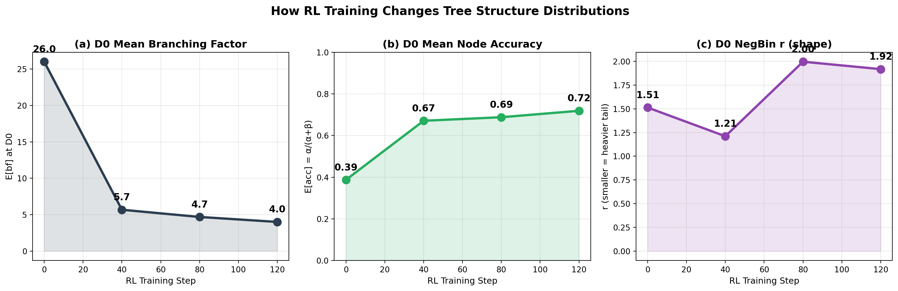
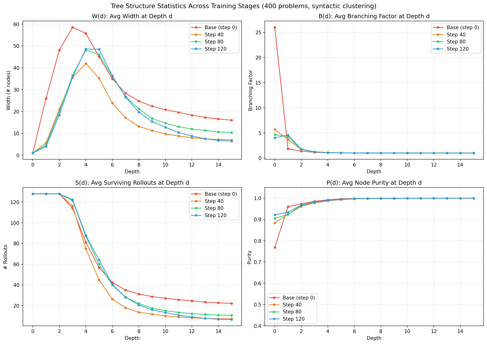
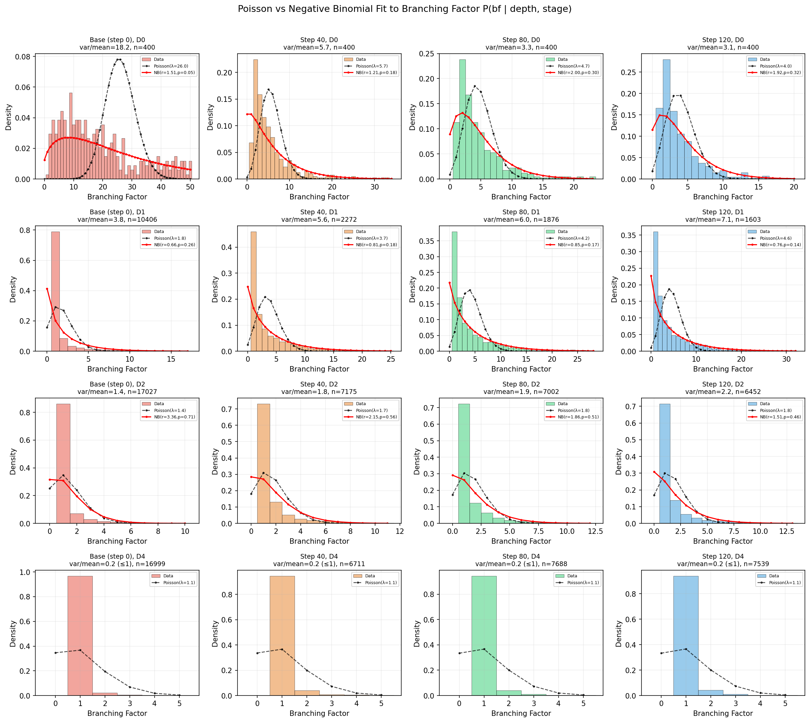
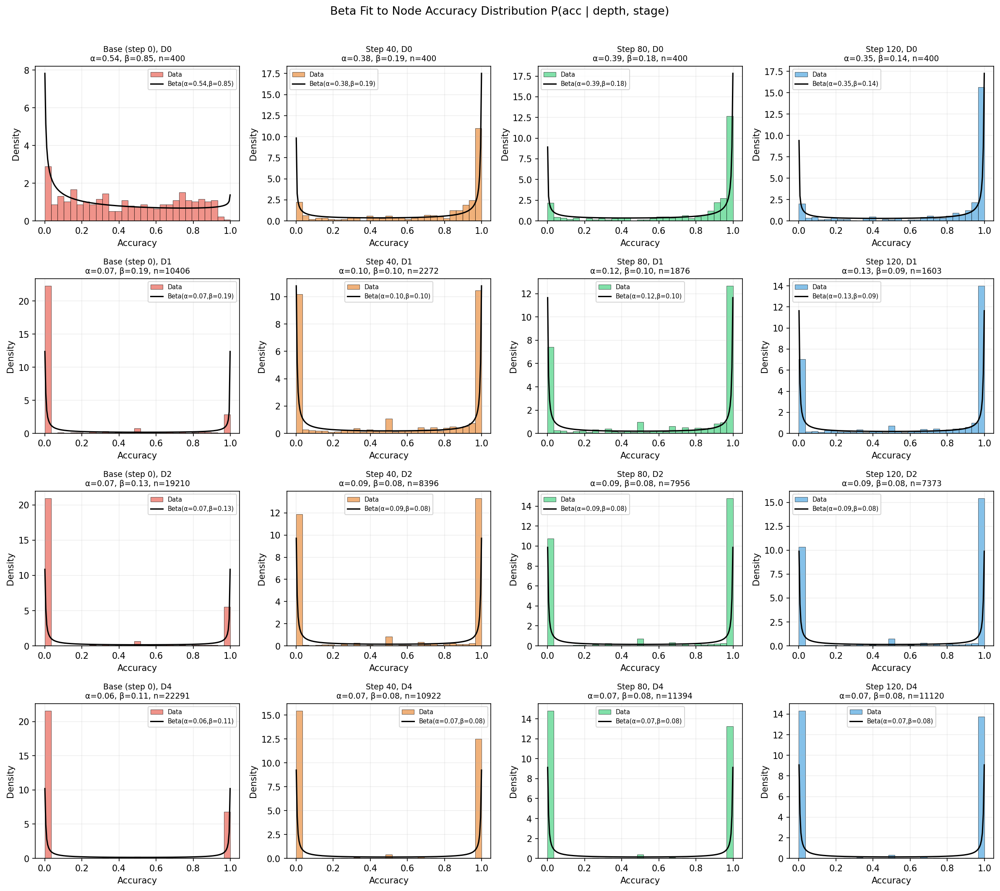

# Flat Rollout Tree Distribution Parameters

> Fitted from 400 MATH500 problems × 4 training stages (1600 trees, 128 rollouts each).
> Syntactic clustering with difflib similarity threshold = 0.3, 256-token chunks.

## Modeling Decision

- **(a)** Dispersion ratio (var/mean) by depth: D0 is severely overdispersed (3-18x), D1+ is underdispersed
- **(b)** D0 NegBin parameters: r controls tail heaviness, p controls mean
- **(c)** D1+ Poisson λ: rapid decay from ~4 to ~1

| Depth | Branching Factor Model | Rationale |
|-------|----------------------|-----------|
| D0    | **Negative Binomial(r, p)** | var/mean = 3~18x, severely overdispersed |
| D1+   | **Poisson(λ)** | var/mean ≤ 1, no overdispersion |

Node accuracy at all depths: **Beta(α, β)** — U-shaped (α, β < 1).

---

## D0: Negative Binomial Parameters

NB parameterization: mean = r(1-p)/p, var = r(1-p)/p²

| Stage | r | p | E[bf] | Var[bf] | Var/Mean |
|-------|------|-------|-------|---------|---------|
| step_0 | 1.513 | 0.055 | 26.0 | 473.3 | 18.2 |
| step_40 | 1.211 | 0.176 | 5.7 | 32.3 | 5.7 |
| step_80 | 1.996 | 0.299 | 4.7 | 15.7 | 3.4 |
| step_120 | 1.918 | 0.324 | 4.0 | 12.4 | 3.1 |

## D0: Beta Parameters (Node Accuracy)

| Stage | α | β | E[acc] |
|-------|-------|-------|--------|
| step_0 | 0.536 | 0.848 | 0.438 |
| step_40 | 0.380 | 0.186 | 0.733 |
| step_80 | 0.390 | 0.177 | 0.772 |
| step_120 | 0.347 | 0.136 | 0.796 |

---

## D1+: Poisson λ (Branching Factor)

| Depth | step_0 | step_40 | step_80 | step_120 |
|-------|--------|---------|---------|----------|
| D1 | 1.85 | 3.70 | 4.24 | 4.60 |
| D2 | 1.37 | 1.71 | 1.75 | 1.78 |
| D3 | 1.14 | 1.24 | 1.25 | 1.26 |
| D4 | 1.06 | 1.09 | 1.10 | 1.10 |
| D5 | 1.02 | 1.04 | 1.04 | 1.04 |
| D6 | 1.01 | 1.02 | 1.02 | 1.02 |
| D7+ | ~1.00 | ~1.01 | ~1.01 | ~1.02 |

## D1+: Beta Parameters (Node Accuracy)

| Depth | step_0 α | step_0 β | step_40 α | step_40 β | step_80 α | step_80 β | step_120 α | step_120 β |
|-------|----------|----------|-----------|-----------|-----------|-----------|------------|------------|
| D1 | 0.070 | 0.192 | 0.103 | 0.104 | 0.125 | 0.098 | 0.126 | 0.092 |
| D2 | 0.067 | 0.129 | 0.086 | 0.082 | 0.091 | 0.078 | 0.092 | 0.076 |
| D3 | 0.065 | 0.111 | 0.080 | 0.078 | 0.082 | 0.075 | 0.082 | 0.074 |
| D4 | 0.063 | 0.113 | 0.072 | 0.081 | 0.074 | 0.078 | 0.075 | 0.077 |
| D5 | 0.062 | 0.128 | 0.067 | 0.089 | 0.068 | 0.085 | 0.069 | 0.083 |
| D6 | 0.062 | 0.160 | 0.063 | 0.106 | 0.064 | 0.098 | 0.065 | 0.093 |

---

## How RL Training Changes the Distributions

1. **D0 branching collapses**: 26 → 4 (model converges to fewer strategies)
2. **Accuracy rises**: 0.39 → 0.72 (more nodes are correct)
3. **NB r increases**: 1.2 → 1.9 (tail becomes less heavy, more concentrated)

---

## Key Observations

1. **D0 branching is heavy-tailed**: Base model has ~26 branches on average but huge variance. After RL training, mean drops to ~4 but still overdispersed (NB r = 1.2-2.0).

2. **D1 is special for trained models**: Trained models (step 40-120) show λ = 3.7-4.6 at D1, higher than D0's ~4-5.7. This means the second level of reasoning has the most diverse branching.

3. **D3+ is nearly linear**: λ = 1.0-1.3, meaning most nodes have exactly 1 child — rollouts have fully diverged by this point.

4. **Beta is U-shaped everywhere**: α, β < 1 at all depths. Nodes are either mostly correct or mostly incorrect — the tree effectively separates good and bad reasoning paths.

5. **RL training shifts accuracy up**: Base model E[acc] at D0 = 0.44, step_120 = 0.80. The Beta distribution becomes increasingly right-skewed (smaller β relative to α).

6. **Practical implication for Poisson-MCTS**: At D0, sample branching factor from NegBin(r,p). At D1+, use Poisson(λ). Initialize node reward priors from Beta(α,β). As depth increases, most branches die (λ→1) and surviving branches become pure.

---

## Fit Quality

---

## Experimental Setup

- **Model**: Qwen2.5-Math-7B-Instruct, DAPO RL training
- **Checkpoints**: step 0 (base), 40, 80, 120
- **Dataset**: MATH500, problems 0-399 (train), 400-499 (validation)
- **Rollouts**: 128 per problem, vLLM with tensor_parallel_size=2
- **Chunking**: 256 tokens per step (Qwen tokenizer)
- **Clustering**: Syntactic (difflib SequenceMatcher, threshold=0.3)
- **Tree building**: Post-hoc from flat rollouts, terminated rollouts preserved as leaves

## Plots in this report

| File | Description |
|------|-------------|
| `hero_distribution_choice.png` | Why NegBin at D0, Poisson at D1+ |
| `negbin_vs_poisson_d0.png` | NegBin vs Poisson PMF comparison at D0 |
| `beta_d0_illustration.png` | Beta distribution shape at D0 per stage |
| `rl_training_evolution.png` | How RL training changes distributions |
| `parameter_heatmaps.png` | Stage x Depth heatmaps for λ and E[acc] |
| `tree_curves_WBSP.png` | W(d), B(d), S(d), P(d) curves |
| `poisson_vs_negbin_histograms.png` | Histogram + fit at D0/D1/D2/D4 |
| `beta_fit_histograms.png` | Beta fit at D0/D1/D2/D4 |
| `parameter_summary.png` | All parameter curves |
