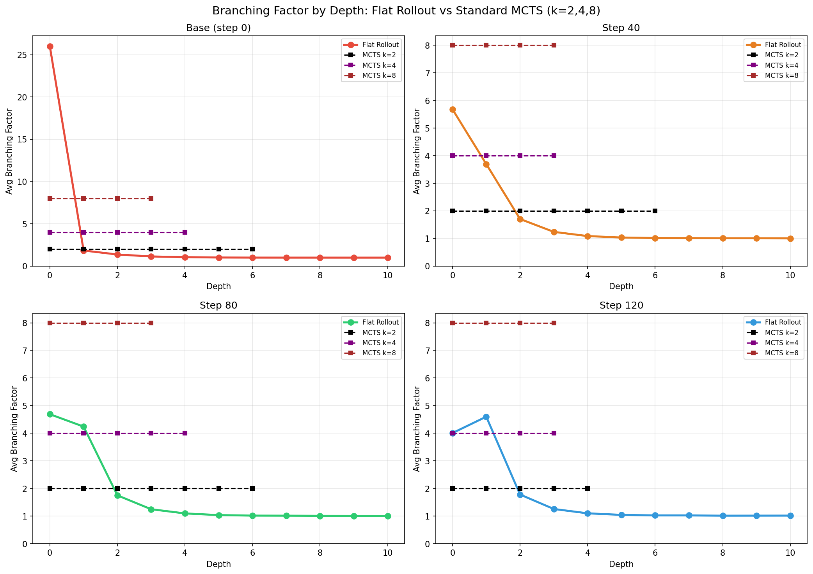
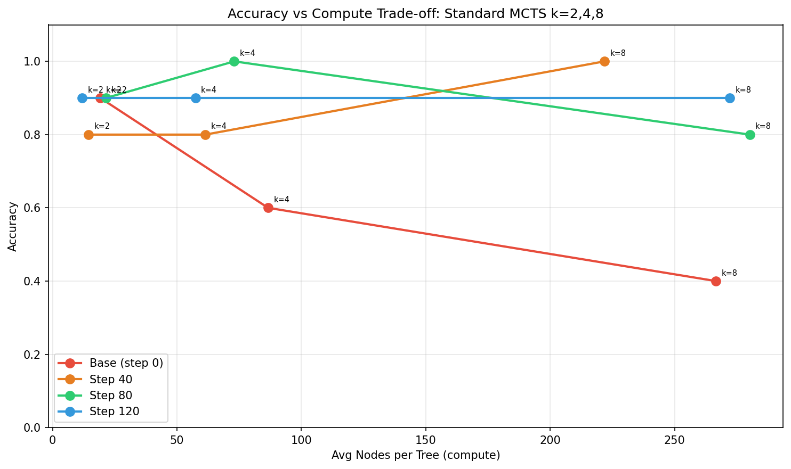
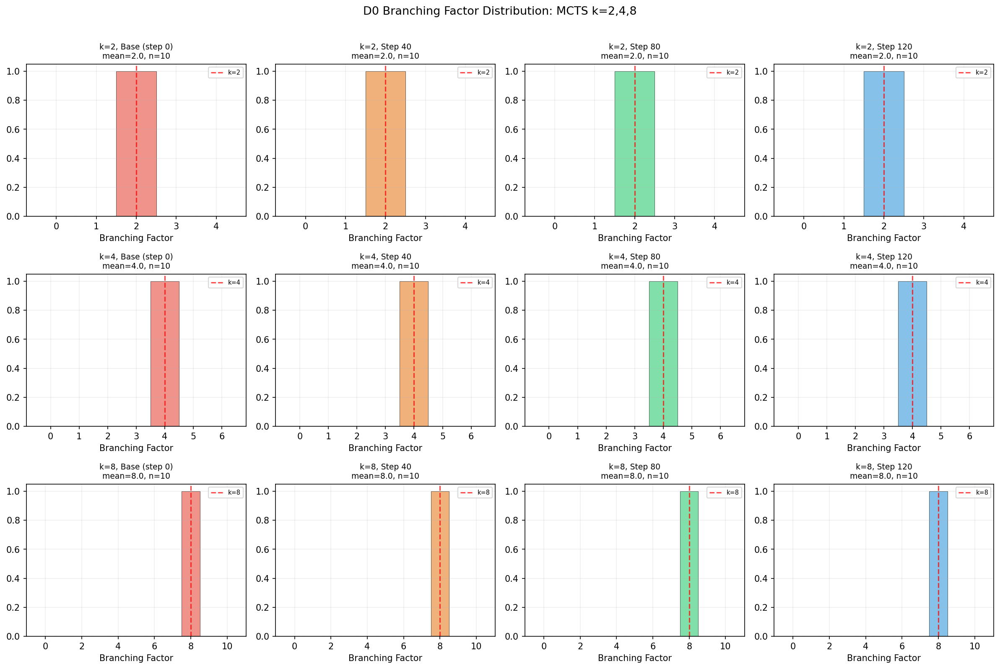

# MCTS 方法综述：LLM 推理中的树搜索策略

> 对比不同树搜索策略在 LLM 数学推理任务中的应用。
> 重点关注：展开策略、分支因子、奖励信号，以及树结构与 flat rollout 的关系。

---

## 1. 方法对比总表

| 方法 | 论文 | 会议 | 展开策略 | 分支因子 | 奖励信号 | 是否用于RL训练 |
|------|------|------|---------|---------|---------|-------------|
| **Standard UCT** | (baseline) | — | 固定 k 个子节点 | k=2~8 (固定) | Logprob / PRM | 否 |
| **ReST-MCTS*** | NeurIPS 2024 | [链接](https://arxiv.org/abs/2406.03816) | PRM引导展开 | 可配置上限 | Process Reward Model | 是 (自训练) |
| **rStar-Math** | Microsoft 2025 | [链接](https://arxiv.org/abs/2501.04519) | 每种action type试一次 | ~5/type | SLM-based PRM | 是 (自演化) |
| **MCTSr** | 2024 | [链接](https://arxiv.org/abs/2406.07394) | 自我修正(非传统展开) | 1 (refine) | LLM自评估 | 否 |
| **TreeRL (EPTree)** | ACL 2025 | [链接](https://arxiv.org/abs/2506.11902) | 在entropy最高的token处fork | 自适应(entropy) | 过程+结果奖励 | 是 (on-policy) |
| **DeepSearch** | ICLR 2026 | [链接](https://arxiv.org/abs/2509.25454) | 全局frontier + entropy引导 | 自适应 | 可验证奖励 | 是 (训练循环) |
| **Poisson-MCTS** | (我们提出) | — | 从分布采样 k | 深度自适应 | TBD | TBD |

---

## 2. 分支策略的四种范式

| 策略 | 代表方法 | 优点 | 缺点 |
|------|---------|------|------|
| **固定 k** | Standard MCTS, AlphaMath | 简单，计算量可控 | 不匹配自然推理的分叉模式 |
| **Entropy 自适应** | TreeRL, ETTRL, DeepSearch | 在不确定处分叉，高效 | 需要计算 entropy；可能遗漏非entropy相关的分叉 |
| **分布引导** | Poisson-MCTS (我们) | 匹配观测到的 flat rollout 结构 | 需要预先从 flat rollout 统计 |
| **自我修正** | MCTSr | 新颖："展开"=改进已有答案 | 非真正的树分叉；多样性有限 |

---

## 3. 实验结果

### 实验配置
- UCT + UCB1, logprob reward（无训练的PRM）
- 128 次 MCTS 迭代/题
- 256 token/节点, 最大深度 16
- k ∈ {2, 4, 8} 个子节点/展开
- Qwen2.5-Math-7B 四个checkpoint (step 0/40/80/120)
- 10 道 MATH500 题 (编号 0-9)

### 3.1 分支因子对比图

**这张图展示：flat rollout 和三种 k 值的 MCTS 的分支因子随深度变化的对比。**

- **彩色实线** = flat rollout 的分支因子（从400题统计）
- **黑色/紫色/棕色虚线** = 标准 MCTS k=2/4/8

核心发现：
- **Flat rollout 是一条"先高后低"的曲线**：D0 分支最多（base model 26，trained model 4-6），然后快速衰减到 D3 附近的 ~1
- **MCTS 是水平直线**：不管什么深度，k=2 就是 2，k=4 就是 4，k=8 就是 8
- **没有任何固定 k 能同时匹配 D0 的高分支和 D3+ 的低分支**。在 D0，k=8 更接近 flat rollout（对 step 40-120）；但在 D3+，k=2 更接近（因为 flat rollout 的 λ ≈ 1）

### 3.2 Accuracy vs Compute 权衡图

**这张图展示：不同 k 值的 MCTS 在"精度"和"计算量（节点数）"之间的权衡。**

- **x 轴** = 每棵树的平均节点数（代表计算量）
- **y 轴** = 准确率
- 每种颜色代表一个训练阶段，线上的三个点分别是 k=2, k=4, k=8

核心发现：
- **k=2 效率最高**：用最少的节点（12-21）达到了 80-90% 的准确率
- **Base model (红色) 随 k 增大而变差**：90% → 60% → 40%。弱模型生成的子节点质量差，k 越大"垃圾"越多，稀释搜索
- **Trained model 对 k 不敏感**：step_120（蓝色）在 k=2/4/8 都是 ~90%，但计算量差 20 倍
- **结论**：增大 k 不是提升性能的有效方式，需要更聪明的分支策略

### 3.3 D0 分支因子分布直方图

**这张图展示：MCTS 在 D0 层的分支因子分布。**

- 每行是一个 k 值（k=2, k=4, k=8），每列是一个训练阶段
- 红色虚线标注 k 值的位置
- 彩色柱状图是实际观测到的分支因子分布

核心发现：
- **MCTS 的分支因子是确定性的**：每个直方图都是一个单点（所有树都是 k=2/4/8），方差为 0
- 这和 flat rollout 完全不同——flat rollout 的 D0 分支因子有巨大的方差（var/mean 高达 18 倍）
- **DeepSearch 也是固定 8**，不随问题难度变化

---

## 4. 完整对比表

| 方法 | step_0 | step_40 | step_80 | step_120 | 平均节点数 |
|------|--------|---------|---------|----------|-----------|
| Flat Rollout (128条) | 43.8% | 73.3% | 77.2% | 79.6% | — |
| Standard k=2 | **90%** | 80% | 90% | 90% | 12-21 |
| Standard k=4 | 60% | 80% | **100%** | 90% | 57-87 |
| Standard k=8 | 40% | **100%** | 80% | 90% | 222-280 |
| DeepSearch | 20% | 80% | 80% | **100%** | 226-365 |

---

## 5. 核心结论

1. **标准 MCTS（任何固定 k）的树结构和 flat rollout 不匹配**：分支因子是常数 vs 深度自适应衰减

2. **增大 k 对弱模型有害**：base model 从 90% (k=2) 降到 20% (DeepSearch)

3. **DeepSearch 有自适应分支但仍不匹配 flat rollout**：divergence 300%+

4. **k=2 是效率最高的 baseline**：最佳 accuracy/node 比

5. **这些差异 motivate Poisson-MCTS**：用 flat rollout 统计出的分布来指导 MCTS 分支决策

---

## 本报告图片索引

| 文件名 | 内容 | 对应章节 |
|--------|------|---------|
| `bf_comparison_all_k.png` | k=2/4/8 vs flat rollout 分支因子曲线 | 3.1 |
| `accuracy_vs_compute.png` | 精度-计算量权衡散点图 | 3.2 |
| `d0_bf_histograms.png` | D0 分支因子分布直方图 | 3.3 |
