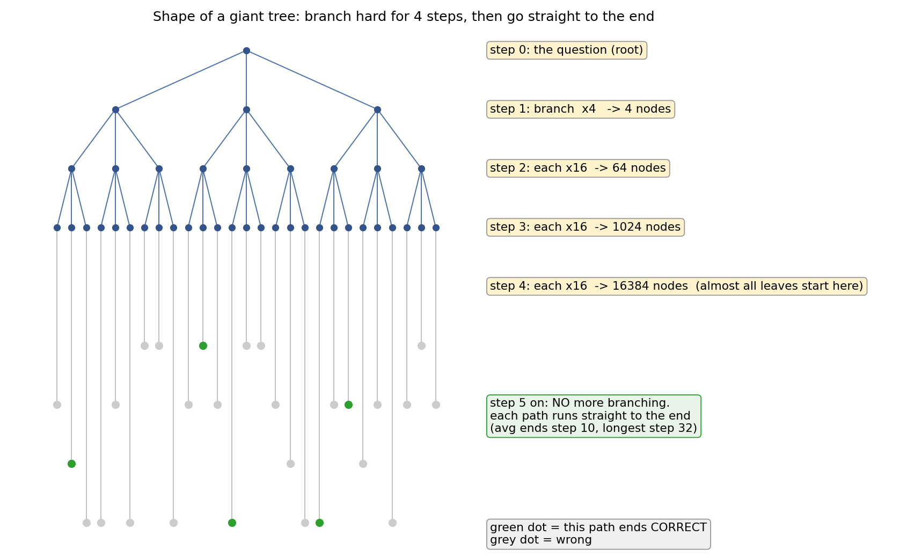
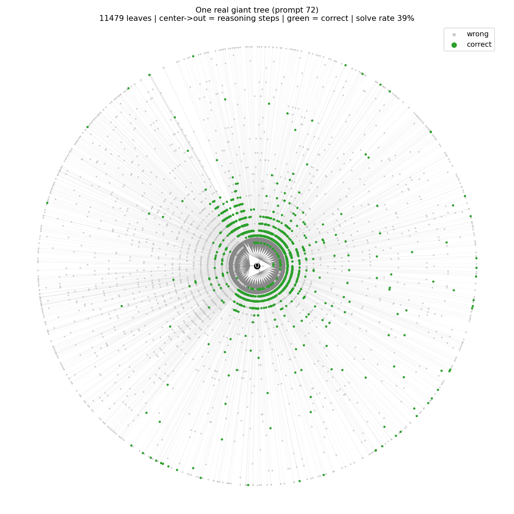
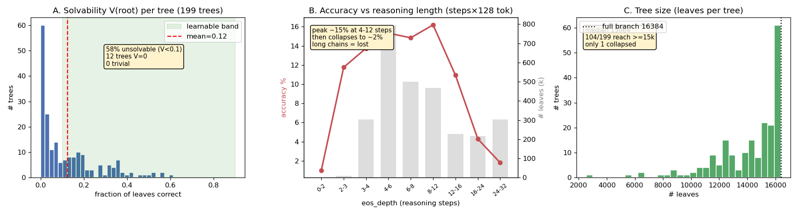
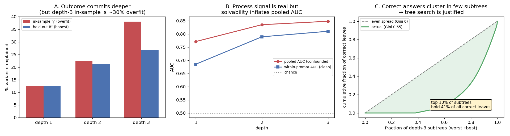
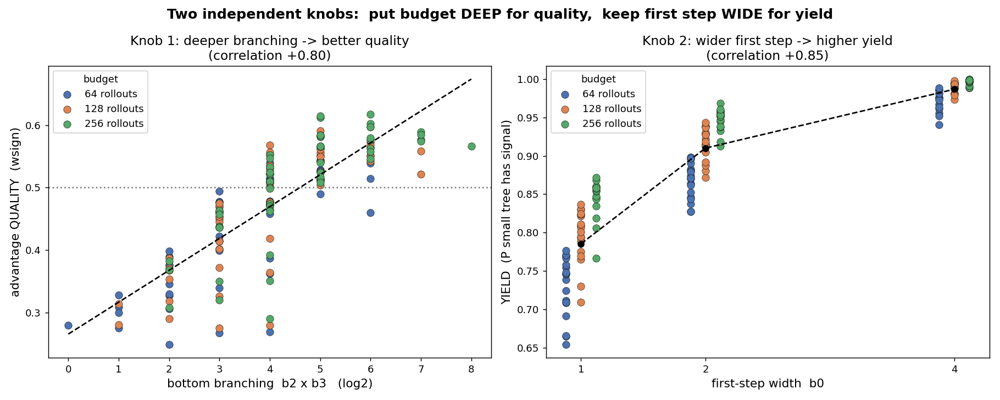
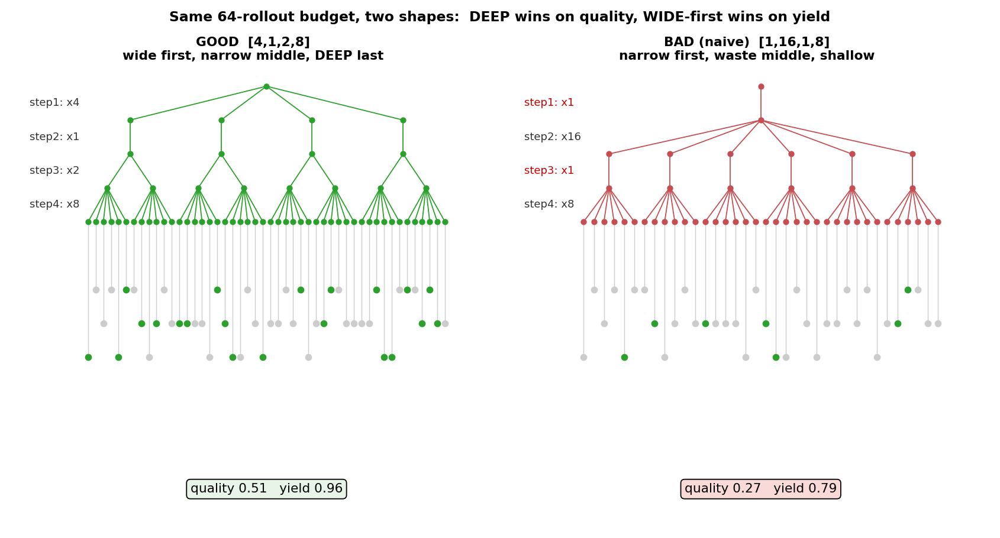
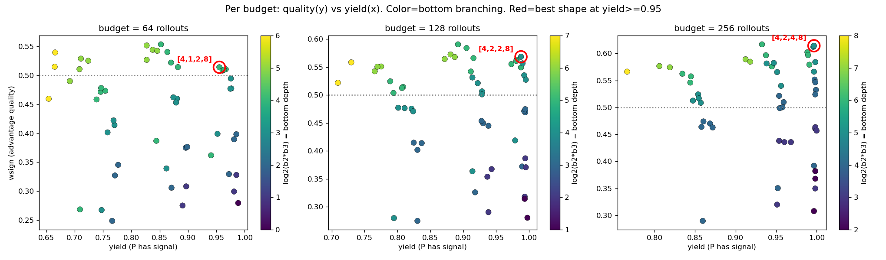

# DAPO-Math Giant Tree 离线分析报告
### 树形如何影响 RL 的 per-step advantage 信号

数据集：`Jianshu001/dapo-math-giant-tree`（199 棵树，2.83M 叶子，Qwen2.5-Math-7B）
所有图在 `figs/` 子文件夹。

---

## 0. 一句话结论

在固定 rollout 预算下，**advantage 信号的好坏由两个独立旋钮决定**：
- **质量**（advantage 方向准不准）← 由**底部分叉深度**决定（越深越好）
- **产出率**（小树有没有信号）← 由**第一步宽度**决定（越宽越好）

最优做法：**第一步分满、中间收窄、预算堆到最后两步**。

---

## 1. 术语定义（先把词说清楚）

### 1.1 树的结构

| 术语 | 定义 |
|---|---|
| **叶子 (leaf)** | 一条从头写到尾的完整解答 |
| **一步 (step)** | 生成的 **128 个 token**（建树时定的 chunk 大小）|
| **giant tree** | 我们采集的大树：第 1–4 步拼命分叉 `[4,16,16,16]`，第 5 步起不再分叉、一路直走到结束。约 16384 条叶子/题 |
| **形状 (schedule) `[b0,b1,b2,b3]`** | 第 1/2/3/4 步各分几个叉。叶子总数 = b0×b1×b2×b3 |
| **small tree** | RL 训练时真正跑得起的小树（几十条 rollout），是 giant tree 的一个子集 |

每一步对应的 token 范围：

| step | token | 分叉 |
|---|---|---|
| 1 | 0–128 | b0 |
| 2 | 128–256 | b1 |
| 3 | 256–384 | b2 |
| 4 | 384–512 | b3（"最深那步"）|
| 5+ | 512 以后 | 不分叉，直走到底 |

### 1.2 价值与 advantage

| 术语 | 定义 | 直觉 |
|---|---|---|
| **V(节点)** | 从这个状态继续写下去，最后答对的比例 | "到达率"。开车去终点（正确答案），这条路能到的车占多少 |
| **advantage A(一步)** | A = V(走完) − V(走之前) | 这一步把胜率拉高(正=好步)还是拉低(负=坏步)。**只看变化，不看高低** |
| **V_true** | 用**很多**叶子算的 V（准，当标准答案）| 派很多车数出来的到达率 |
| **V̂ (V-hat)** | 用小树**那几条**叶子算的 V（噪声大）| 只派几辆车数出来的，会有运气成分 |

### 1.3 评价指标

**wsign（质量）= advantage 方向估对的比例，按 |A| 加权**

- 对每条边：真相 A_true 和估计 Â 的**正负号**是否一致
- 按 |A_true| 加权（大 advantage 估错惩罚重，小的无所谓）
- 公式：`wsign = Σ|A_true|·[符号一致] / Σ|A_true|`
- **0.5 = 瞎猜，1.0 = 完美**

**yield（产出率）= 一棵小树"有信号"的概率**

- "有信号" = 采出的轨迹里**既有对的、又有错的**（这样 advantage 才不是 0）
- 全对或全错 → 没有高低差 → advantage 全 0 → 这批白训

**solvability V(root)** = 整棵树答对的比例。据此分三类：
- V=0（12 棵）：根本不可能产生 reward → 排除
- 0<V<0.1（116 棵）：near-unsolvable → 排除
- **V∈[0.1,0.9]（83 棵，in-band）：有信号 → 只分析这些**

---

## 2. Giant tree 长什么样

### 2.1 结构示意



前 4 步拼命分叉（4×16×16×16 ≈ 16384 个起点），第 5 步起不再分叉、每条直走到结束（平均第 10 步、最长第 32 步）。

### 2.2 一棵真实的树



中心向外 = 推理步数；绿点 = 答对。可以看到**正确答案扎堆在某几块区域**（不是均匀散开）——这正是 tree search 有意义的前提。

### 2.3 数据集整体画像



- **可解性极低**：平均 solve rate 0.123，58% 的题 near-unsolvable，12 棵一条都没对，0 棵 trivial。
- **准确率 vs 长度是倒 U**：4–12 步见顶 ~15%，之后断崖，24–32 步只有 1.8%。**写得越长越可能是错的。** 正确答案中位才 6 步。
- **树是满的**：中位 15064 叶，质量高。

---

## 3. 怎么分析 small tree（方法）

核心思路：**用 giant tree 当"考官"，给各种 small tree 形状打分，全程离线、零 LLM 调用。**

```
giant tree (16384 条, V 当真值)
      │  ① 按某个形状 [b0,b1,b2,b3] 从里面抠出一棵小树
      ▼
small tree (几十条, 模拟 RL 真正会用的)
      │  ② 用小树的叶子估 V̂、算 Â
      ▼
③ 把 Â 跟 giant tree 的真值 A_true 对比 → 这个形状准不准(wsign)
```

**防作弊（held-out）**：每棵树的叶子**随机分两半**——一半锁起来当标准答案（算 V_true），另一半才给小树用（算 V̂）。两边不重叠，分数才真实。
> 注意：随机分一半砍的是"叶子密度"，**不改变树的形状**。`[4,16,16,16]` 分完还是 `[4,16,16,16]`，只是每个最深节点的叶子从 ~16 变 ~8。

**树内部结构验证**（确认信号是真的）：



- outcome 渐进往深处定（within-prompt AUC 0.69→0.79→0.81，干净、去掉了 between-prompt 混淆）。
- in-sample 的"可解释方差"在深层约 30% 是过拟合（38%→26.7%），要用 held-out 的数。
- 正确叶子高度扎堆（Gini 0.65，最好 10% 的子树装了 41% 的正确叶）。

---

## 4. 核心发现：两个独立旋钮



| 旋钮 | 影响 | 相关性 |
|---|---|---|
| 底部分叉 b2×b3（后两步）| → **质量** wsign | **+0.80** |
| 第一步宽度 b0 | → **产出率** yield | **+0.85** |
| 中间宽度 b1（第二步）| 两样都不给，**纯浪费** | 质量 −0.65 |

**该这样 vs 别这样**（同 64 条预算）：



---

## 5. 每个预算选哪个形状



| 预算(rollout) | 最优形状 | 质量 | 产出率 | 最差（避开）|
|---|---|---|---|---|
| 64 | `[4,1,2,8]` | 0.51 | 0.96 | `[1,16,1,4]` 0.25 |
| 128 | `[4,2,2,8]` | 0.57 | 0.99 | `[1,16,1,8]` 0.27 |
| 256 | `[4,2,4,8]` | 0.61 | 1.00 | `[1,16,1,16]` 0.29 |

规律：最优都是 `[4, 小, 中, 8]`；最差都是 `[1,16,1,*]`（=naive 做法）。

天花板：连整棵 giant tree 的 wsign 也只有 **0.68**——因为深层 V 即使在 giant tree 里也只靠 ~16 条续写撑着，本身就噪。

---

## 6. 给 RL 的建议（按优先级）

1. **先 filter**：扔掉 V<0.1 的题（58%），零信号纯浪费算力。
2. **rollout 摆成 `[4, 1~2, 中, 8]`**：第一步分满（保产出率）、预算堆到最后两步（保质量）。别用 naive 的独立采样（=最差形状）。
3. **配重采**：小树全错就丢掉重采（DAPO 式 dynamic sampling），兜住深形状偏低的产出率。
4. **加长度惩罚**：长链几乎必错，是免费的负向信号。

---

## 7. 待验证 / 局限

1. **结论基于 78 棵 in-band 树**（V∈[0.1,0.9]），held-out 防作弊，但 wsign 仍有方差。
2. **"更深的分叉"这份数据答不了**：giant tree 第 5 步起是单链（A≡0 by construction），信号只覆盖前 512 token。要研究中后段（往往真正算错的地方），需采一版**分叉点更靠后/更深**的数据。
3. 绝对 wsign 数偏低（天花板 0.68），但形状间的**排序**（深>宽、b0 保产出率）是稳的。

---

## 附：代码文件（在 `/home/jianshu.she/mcts/`）

| 文件 | 作用 |
|---|---|
| `tree_loader.py` | 从 128-token chunk 重建树形 + 算 V |
| `simulator.py` | 抠小树、held-out 分半、算 advantage |
| `run_holdout.py` / `run_yield.py` | wsign + yield 分析 |
| `enumerate_budgets.py` | 固定预算枚举所有形状（出第 5 节的表）|
| `draw_tree.py` / `draw_schematic.py` | 画图 |
